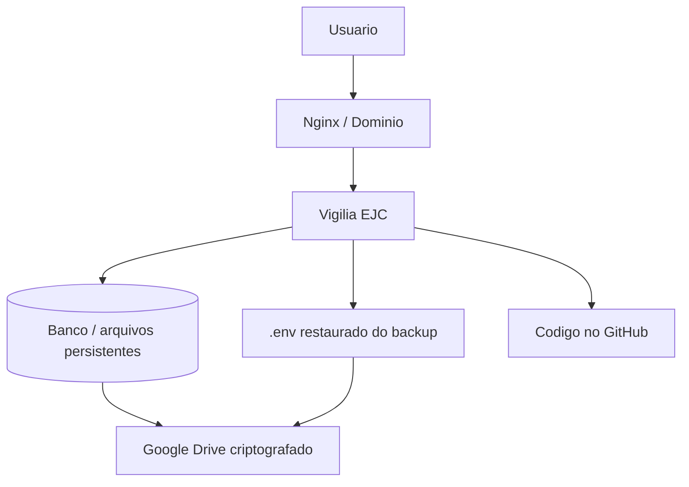

# Fluxo - Vigilia EJC

```mermaid
flowchart TD
  U[Usuario] --> N[Nginx / Dominio]
  N --> A[Vigilia EJC]
  A --> ENV[.env restaurado do backup]
  A --> DB[(Banco / arquivos persistentes)]
  DB --> GD[Google Drive criptografado]
  ENV --> GD
  A --> GH[Codigo no GitHub]
```
