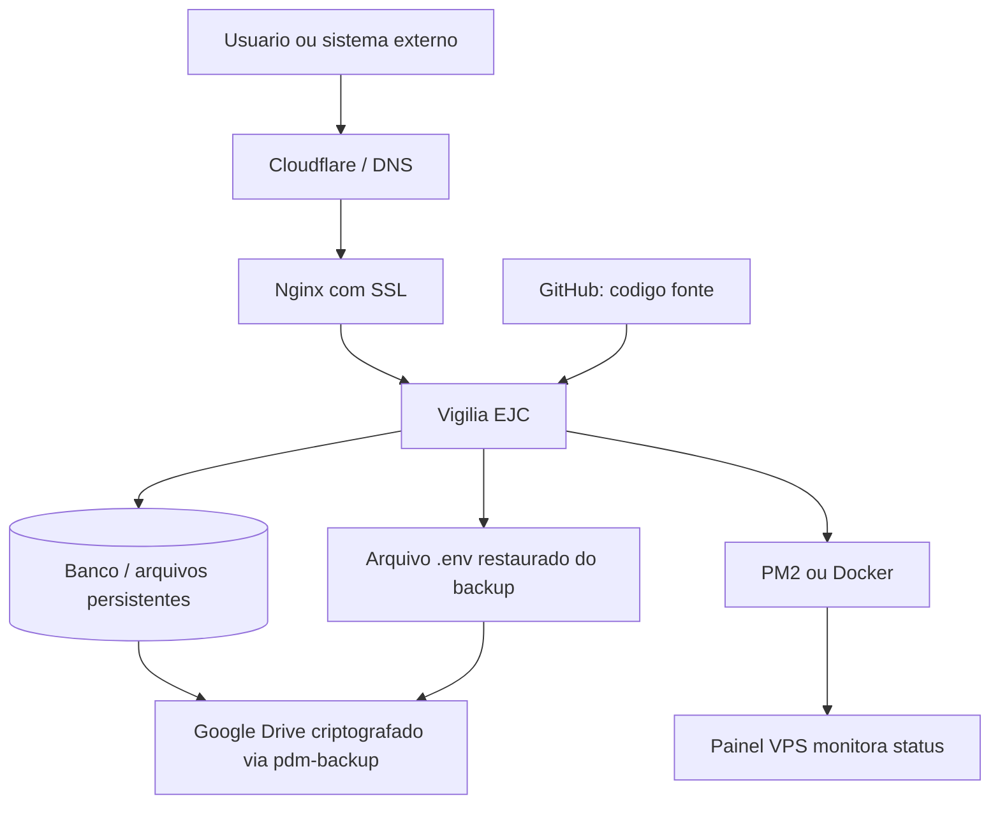

# Fluxograma - Vigilia EJC

## Leitura rapida

- GitHub guarda codigo e documentacao.
- Google Drive guarda dados que nao podem se perder.
- Nginx publica o dominio com SSL.
- PM2 ou Docker mantem o servico rodando.
